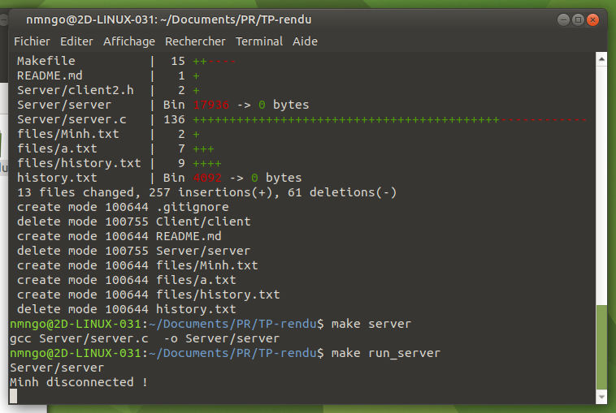
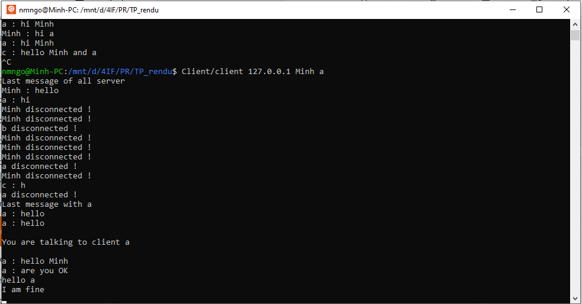
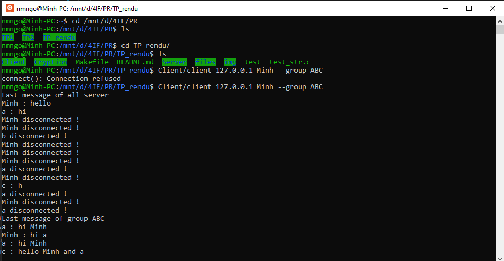

# TP Programmation Réseaux
4IF NGO Ngoc Minh, EL BOU Aicha
## Execute 
- Execute Client.c `make client`
- Execute Server.c `make server`
## Run the excutables
- Run the server `make run_server`
- You have to run the server before running the client `Client/client [address] [pseudo]` for chatting in all server or `Client/client [address] [pseudo] [pseudo_of_destinator]` for private chat with `pseudo_of_destinator`
- You can do the group chat by command `Client/client [address] [pseudo] --group [nom_of_group]`. We note that `nom_of_group` are 2-to-2 identical.
For example
```
Client/client 127.0.0.1 Minh
```
I am Minh and I would to do server chat in localhost.
```
Client/client 127.0.0.1 Minh a
```
I am Minh and I would to chat with client `a` in localhost.
```
Client/client 127.0.0.1 Minh --group ABC
```
I am Minh and I want to do group chat. This group is named ABC. If it doesn't exist in program, the program creates a group named `ABC`.
```
Note: pseudos of clients have to be 2-to-2 identical.
```
## Functionnalities we have developed
1. Server is informed when a client is disconnected.

2. Restore the history of all server chat when a client connects to do the chat and Save history of server chat. Save the conversation in `files/history.txt`
3. Private discussion of 2 clients in a server.
4. Save the private chat when destinator is offline. For example, `sender` want to talk to `destinator` but `destinator` is offline. The conversation will be saved in `files/[destinator].txt`. When `destinator` connects, 
+ The conversation of all server is restored first, 
+ and then last conversation with `destinator` will be restored. (image below)

5. We do the group chat. If the group already exist, the message of the group is restored from a file named `files/group_[nom_of_group].txt`. When the server is down, all history of group conversation will be saved in the same file.
+ The conversation of all server is restored first, 
+ and then last conversation in the group chat will be restored. (image below)

6. Message cryptage by "chiffrement RSA". We haven't finished this part but our idea is to encrypt all the history of conversations and then save in a file. With private and public key of method RSA, we can retrieve the original message. 
7. If you want to change chat room, like you are currently in group chat `ABC`, but now you want to chat with client `a`, you have to close this chat room by pressing Ctrl+C to end the client session. Then you put the command `Client/client 127.0.0.1 [your_pseudo] a` to chat with `a`
